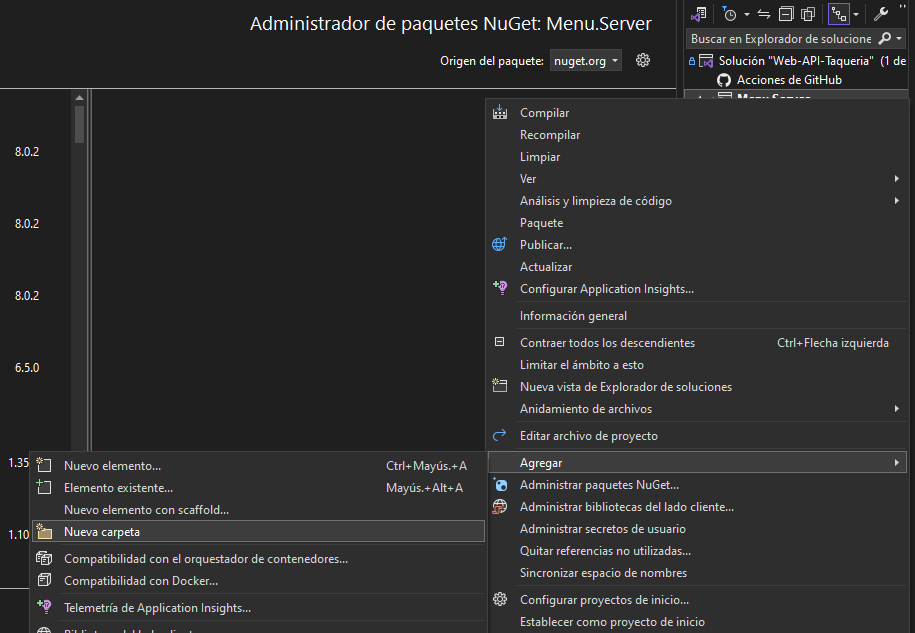

# Crear WEB´S API con .NET y SQL SERVER

## Creacion de una Web api con asp.net

- Para inicializar un proyecto en Visual Studio lo primero que tenemos que realizar es dirigimos a `Crear un Proyecto`

- Posteriormente seleccionamos  el tipo de proyecto que necesitemos en este caso seleccionamos una `Solucion en Blanco` y le damos en `siguiente`

- Llegando hasta este paso definimos el nombre del proyecto y le damos en `Crear`

- Para empezar a crear nuestra API damos click derecho sobre nuestra soluccion nos deslizamos hasta la pestaña `Agregar` y seleccionamos  `Nuevo proyecto`

- Seleccionamos el tipo de proyecto  `ASP.NET Core Web API C#` y le damos click en `Siguiente`

- Definimos el nombre del Proyecto de nuestra  que sera el servidor de nuestra  Web API le damos click en `Siguiente`

- Seleccionamos la configuracion deseada en este caso el Framework sera `.NET 8.0` sin Authentication de campo y con la configuracion que viene por defaul, para poder crear la soucion le damos click en `Crear`

- Para poder trabajar con `SQL SERVER` necesitamos instalar algunos packetes para esto damos click derecho en nuestro proyecto, y nos deslizamos hasta donde este `Administrar paquetes NuGet para la solucion...`

- Seleccionamos e instalamos los siguientes packetes para nuestro proyecto

- Listo todo esto podemos empezar a crear nuestro proyecto lo primero que tenemos que hacer es crear una carpeta con el nombre `Models` para esto damos click derecho sobre nuestro proyecto nos desplazamos hasta agregar y seleccionamos nueva carpeta

